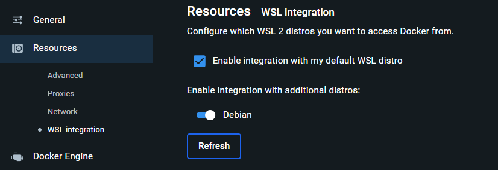
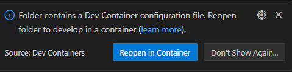

<!--
SPDX-FileCopyrightText: 2024 Henrik Jakob jakob@ibb.uni-stuttgart.de
SPDX-License-Identifier: MIT
-->

# ikarus-devcontainers

This is a guide on how to use `Ikarus` and affiliated projects like `dune-iga`  within Visual Studio Code with the help of devcontainers on Windows.
For Linux many of the steps are the same, but of course, WSL is not needed, etc.

## Baseline prerequisites

- We need some kind of new-ish system with Win10 or Win11, at least 16 GB RAM and a CPU that is not made out of wood (I would suggest at least 8 cores)
- Download the following Apps
  - [VS Code](https://code.visualstudio.com/download)
  - [Docker Desktop](https://www.docker.com/products/docker-desktop/) (this includes the docker engine)
  - [Git](https://www.git-scm.com/download/win), if you want a UI, you can download [Gitkraken](https://www.gitkraken.com/download) (free for public repos)
- If the following steps produce an error, then maybe hardware virtualization has to be activated. Refer [here](https://docs.docker.com/desktop/troubleshoot/topics/#virtualization), maybe the option has to be turned on in the BIOS
- Open the Windows Powershell (don't do this in Admin-Mode as suggested by Microsoft, you may have to elevate the shell after opening it normally)

```shell
wsl --install
wsl --set-default-version 2 #(Is not needed for Windows 11)
```

- This should install WSL (Windows Subsystem for Linux)
- Reboot if requested
- Download and install Docker for Windows. During the installation, select the option "Install required Windows components for WSL 2"
- Now try and open Docker. If your system is managed by some kind of Active Directory, you may have to do the following steps
  - Open computer management as admin (deutsch: Computerverwaltung)
  - Go to Local users and groups and find docker-users (deutsch: Lokale Benutzer und Gruppen)
  - Add your Account (or a group of which you are a member) to the group.
  - Restart your computer
- In the Docker settings, select Ubuntu or a different Distro you may have installed as your WSL2 distribution as shown in the screenshot
 
- Now you should be good to go
  
## Use devcontainers as your development environment

- Now the easy part, install VS Code
- The following part now assumes that you want to use Ikarus as a developer
- Pull the most recent docker container on a command line (Powershell, WSL, Debian)

```shell
docker pull ikarusproject/ikarus-dev-clang:latest
```

- Pull the Ikaurs GitHub [repository](https://github.com/ikarus-project/ikarus.git) into a local folder (this can be done via cmd or Gitkraken, etc)
- Also, copy the folder `.devcontainer` from the folder `devcontainers/ikarus/` into your local project folder
- Copy the files `docker-compose.yml` into the project folder, so that it looks like that

```
- Project Folder
  - ...
  - docker-compose.yml
  - .devcontainer
    - devcontainer.json
```

- Now open the folder in VS Code, in the bottom there should be a message popping up, giving you the option to open the folder in a devcontainer

- If not, press Strg-Shift-P type `reopen` in container` and hit enter when it appears
- Now the Devcontainer should be built in the background, the first startup will take some time, so don't be impatient
- When everything has settled, a prompt will ask you to specify the compiler you want to use and then cmake will configure (this can take some time and has to be done every time you open VS Code :/)
- You can choose the compiler you want, I would suggest clang-16
- Via the cmake configure window you can specify the build and run target as sandbox to see if everything works

### Overview of projects, docker images, and compilers

| Project            |              docker image               |              Compilers               |
| :----------------: | :-------------------------------------: | :----------------------------------: |
| ikarus (developer) | `ikarusproject/ikarus-dev-clang:latest` | clang-16, clang-17, clang-18, gcc-12 |
| ikarus (user)      | `ikarusproject/ikarus-clang:latest` | clang-16, clang-17, clang-18, gcc-12 |

- Periodically run the pull commands to update the images, you can then rebuild your devcontainers via the VS Code command palette (Str-Shift-P)

### Explanation of the VS Code settings in the devconatiners

- We favor using `clangd` as the language server over Microsoft's IntelliSense, it is preconfigured to work out-of-the-box
- For formatting we use `clang-format` with the provided `.clang-format`The Python path is altered to use the dune Python binary which allows us to compile the Python bindings
- Other than the last one, you can make any change to the settings and everything should still work

## Use Ikarus as a User (C++)

## Use Ikarus as a User (Python)
